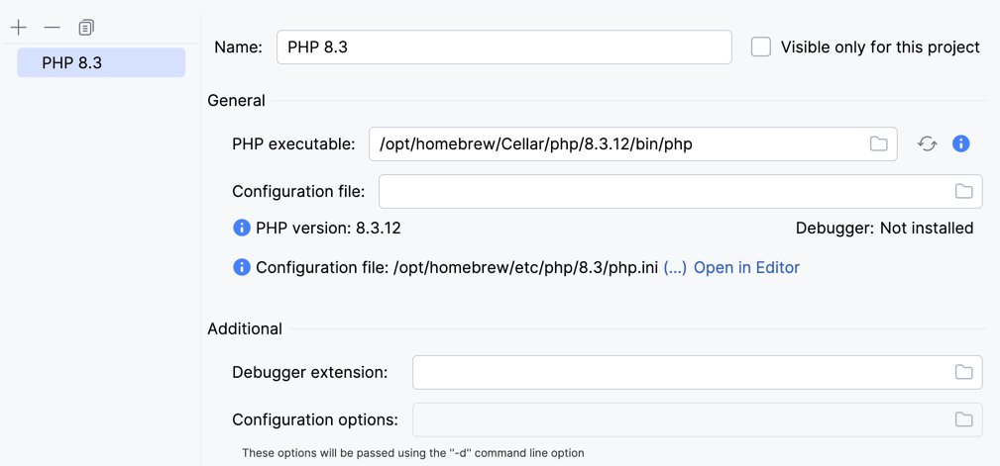
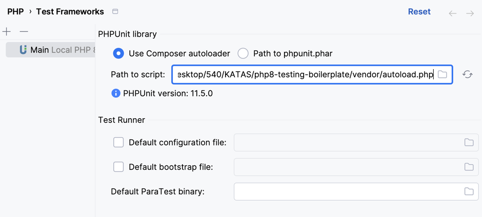

# Instrucciones para configurar el repositorio
- Forkea este repositorio y create uno propio a partir de este.
- Clona el repositorio en tu local.
- Asegúrate de tener instalado PHP 8.3 en local.
    - Si no, puedes instalarlo con [Homebrew](https://brew.sh/index_es).
      ```bash
      brew install php@8.3
      ```
- Lanza el comando `composer install` para instalar las dependencias.
- Configura el CLI Interpreter de PHP 8.3 en tu IDE. (Debería ser parecido a lo siguiente)
  
- Configura el test framework de tu IDE para PHPUnit. (Selecciona el archivo `/vendor/autoload.php` como el archivo de configuración de PHPUnit)
  
- Comprueba que puedes correr los tests.
- ¡A desarrollar!
